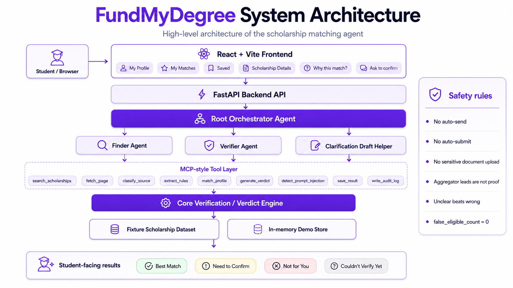
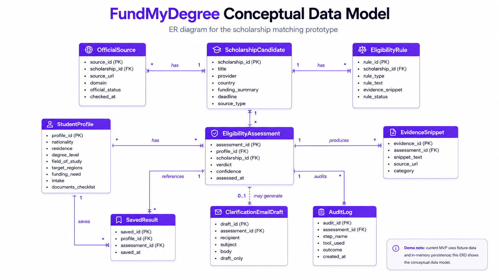
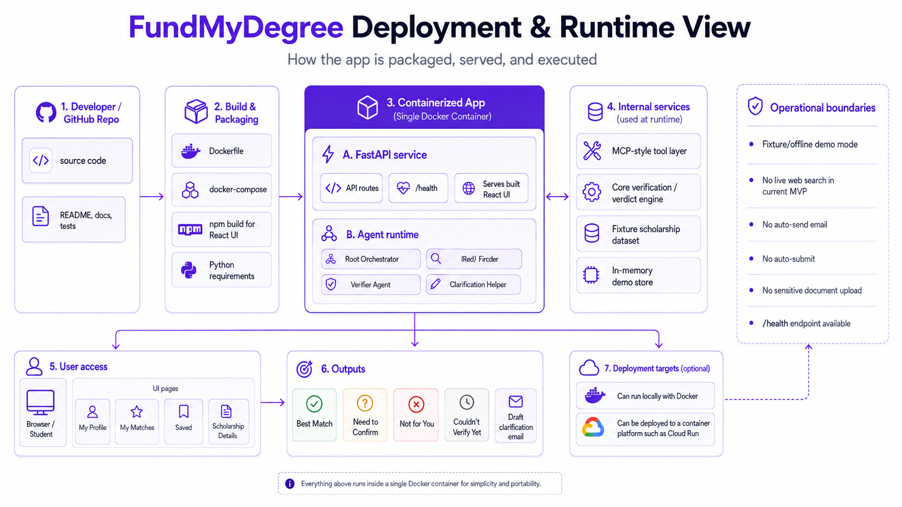

# FundMyDegree

**Find scholarships that actually fit you.**

FundMyDegree is a scholarship matching and fit-checking prototype for international students.

I built this from a problem I have personally faced as a Sri Lankan graduate trying to find a realistic path to study abroad. Scholarships can decide whether studying abroad is even possible, but finding the right ones is rarely as simple as searching a list. For the past two years, I have spent time opening scholarship links, university pages, and country-by-country funding pages, only to later realize that Sri Lankan students were not eligible, my degree level did not match, the scholarship was outdated, the funding was not enough, or the rules were too unclear to trust.

The question I wanted help answering was simple:

```text
Is this scholarship worth my time?
```

FundMyDegree is my answer to that question. It does not try to be a giant global scholarship directory. It focuses on a smaller, more useful workflow: take a student profile, compare it against scholarship evidence, and explain what looks like a fit, what needs confirmation, and what may not be worth pursuing.

This is a Kaggle AI Agents capstone prototype. It uses fixture/offline demo data so the project can be reviewed and tested reproducibly.

## Why I Built This

Most scholarship search tools give students more links. More links are useful only if the student can quickly understand whether those opportunities actually apply to them.

As an international student from Sri Lanka, the painful part has not been only finding scholarship names. It has been checking the fine print: nationality rules, residence rules, degree level, subject restrictions, funding coverage, deadlines, and whether the source is official. A scholarship can look perfect in a search result and still be a poor use of time once the eligibility rules are checked properly.

FundMyDegree was built to make that uncertainty visible earlier. It is meant to help a student slow down at the right moment and ask: does this opportunity really fit my profile, or do I need to confirm something before investing hours into it?

## What FundMyDegree Does

- The student fills a lightweight study profile.
- The system shows scholarship matches from fixture/offline demo data.
- The student opens a scholarship to see a fit check.
- The system explains what fits the profile, what still needs confirmation, and what may block eligibility.
- The student can save a scholarship for later.
- If the result is unclear, the system can draft a clarification email.
- The app never sends the email automatically.

## Why This Is Different From A Normal Scholarship List

Most tools stop at discovery. They help answer:

```text
What scholarships exist?
```

FundMyDegree adds a fit-checking layer. It tries to answer:

```text
Is this scholarship likely worth this student's time?
```

That difference matters because an opportunity can be real but still not fit a specific student. FundMyDegree keeps the reasoning visible and uses conservative labels instead of pretending every match is certain.

## Demo Flow

1. Complete My Profile.
2. View My Matches.
3. Open a scholarship.
4. Review why it matches or does not match.
5. Save it or use Ask to confirm for unclear cases.

## System Diagrams

### High-Level System Architecture



This view shows how the student UI, FastAPI backend, agent layer, MCP-style tools, core verifier, fixtures, and eval harness fit together.

### Conceptual Data Model



This view shows the main records used by the prototype: student profiles, scholarship candidates, verification results, evidence, audit events, saved results, and clarification drafts.

### Deployment And Runtime View



This view shows the local and container runtime shape: a React/Vite frontend, FastAPI backend, fixture data, health/docs endpoints, and smoke checks.

## How The Agent Works

The workflow is intentionally narrow:

```text
Student profile
-> Finder Agent identifies candidate scholarships
-> Tool layer loads scholarship and source data
-> Verifier Agent checks source evidence and eligibility rules
-> Conservative verdict engine chooses the safest status
-> UI explains the result in student-friendly language
```

The Root Orchestrator coordinates the flow. It does not invent eligibility decisions.

The Finder Agent searches fixture scholarship data and returns structured candidates. It never decides eligibility and never labels anything as a strong match.

The Verifier Agent checks the candidate through the tool sequence: fetch source, classify source, detect prompt injection, extract rules, match the student profile, generate a conservative verdict, and write an audit log.

The clarification helper can draft an email only when the status is unclear. It returns a draft for the student to review and copy. It never sends email.

## Safety Decisions

- No automatic email sending.
- No application submission or portal autofill.
- No passport, bank statement, transcript, or offer-letter upload.
- The document section is a checklist only.
- Aggregator leads are not treated as proof.
- Fetched page text is treated as untrusted content, not instructions.
- Eligible is impossible without official source evidence.
- Missing key evidence becomes Need to Confirm or Couldn't Verify Yet.
- The hard evaluation target is `false_eligible_count = 0`.

The guiding rule is:

```text
Unclear beats wrong.
```

## Course Concepts Demonstrated

For the capstone submission, FundMyDegree demonstrates the required concepts through the working system rather than by storing external course artifacts in the repo:

- Agent / multi-agent workflow: Root Orchestrator, Finder, Verifier, and clarification helper.
- MCP-style tool layer: structured tools under `fundmydegree/mcp_server/`.
- Agent Skills: focused skills under `.agent/skills/`.
- Security features: official-source gate, prompt-injection detection, no auto-send, no auto-submit, no sensitive uploads, audit logs.
- Evaluation: fixture-based evals with `false_eligible_count = 0`.
- Deployability: FastAPI, React/Vite, Docker, Docker Compose, `/health`, and deployment smoke checks.
- Antigravity: development workflow evidence can be shown in the demo process without keeping unrelated image dumps in the public repository.

## Current Limitations

- Fixture/offline demo mode only.
- No live global scholarship search yet.
- No account system yet.
- No persistent database yet.
- No payment or subscription system.
- No guarantee of admission, funding, eligibility, or scholarship success.
- Final decisions still belong to the scholarship provider, university, or funding body.

## Tech Stack

- Frontend: React + Vite.
- Backend: FastAPI.
- Core logic: Python data models, source classification, rule extraction, profile matching, and conservative verdicting.
- Agent layer: ADK-style Python agent classes.
- Tool layer: MCP-style Python tool registry and structured tool outputs.
- Evaluation: fixture-based Python eval runner and smoke tests.
- Deployment: Docker, Docker Compose, and single-container static frontend plus API serving.

## Run Locally

Create and activate a virtual environment:

```bash
python -m venv .venv
```

On Windows PowerShell:

```bash
.\.venv\Scripts\Activate.ps1
```

On macOS/Linux:

```bash
source .venv/bin/activate
```

Install backend dependencies:

```bash
pip install -r requirements.txt
```

Run the backend:

```bash
python -m fundmydegree
```

Open the backend docs:

```text
http://127.0.0.1:8000/docs
```

Run the frontend:

```bash
cd fundmydegree/ui
npm install
npm run dev
```

Open the frontend:

```text
http://127.0.0.1:5173/
```

Run the tool layer:

```bash
python -m fundmydegree.mcp_server list
python -m fundmydegree.mcp_server call classify_source fixture_id=eligible_01
```

Run with Docker:

```bash
docker build -t fundmydegree-scholarship-agent .
docker run --rm -p 8080:8080 fundmydegree-scholarship-agent
```

Docker URLs:

```text
http://127.0.0.1:8080/
http://127.0.0.1:8080/docs
http://127.0.0.1:8080/health
```

## Tests

Run the verification evals:

```bash
python -B evals/run_evals.py
```

Run smoke tests:

```bash
python -B scripts/smoke_api.py
python -B scripts/smoke_tools.py
python -B scripts/smoke_agents.py
python -B scripts/smoke_deploy.py
```

Run the frontend build:

```bash
cd fundmydegree/ui
npm run build
```

Expected key result:

```text
false_eligible_count = 0
```

## Project Structure

- `fundmydegree/ui/` - React/Vite student UI.
- `fundmydegree/api/` - FastAPI backend routes and services.
- `fundmydegree/agents/` - Root Orchestrator, Finder, Verifier, and clarification helper.
- `fundmydegree/mcp_server/` - MCP-style tool registry and tool implementations.
- `fundmydegree/core/` - trusted source checks, rule matching, verdict policy, and shared models.
- `.agent/skills/` - focused agent skill instructions.
- `fixtures/` - offline scholarship fixtures.
- `evals/` - golden eval cases and eval runner.
- `scripts/` - smoke tests.
- `docs/` - system architecture, security, evaluation, deployment, and product notes.
- `Dockerfile` and `docker-compose.yml` - containerized demo setup.

## License

MIT License.
