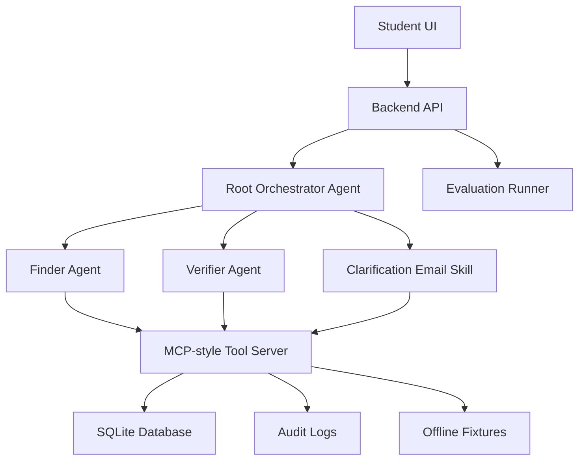

# ScholarProof

Find scholarships that are real - and right for you.

ScholarProof is a Kaggle AI Agents: Intensive Vibe Coding Capstone project for the Agents for Good track.

## Problem

International students do not need another messy scholarship list. They need to know whether an opportunity is real, current, official, and actually applicable to their profile before spending time applying.

ScholarProof answers questions like:

- Is this scholarship real?
- Is it from an official source?
- Is it current?
- Can my country apply?
- Does my degree level match?
- Does my field match?
- Is the funding enough?
- Is the deadline still open?
- Do I need a separate application?
- Am I wasting time?

## Solution

ScholarProof uses a focused agent workflow to:

1. Collect a lightweight student profile.
2. Find candidate scholarships.
3. Verify official sources.
4. Extract eligibility rules.
5. Match rules against the student profile.
6. Produce conservative verdicts with evidence.
7. Draft clarification emails when rules are unclear.
8. Save simple verified results.

## Core Rule

Unclear beats wrong.

ScholarProof never marks a scholarship as `eligible` unless official evidence proves the key eligibility rules.

## Student-Facing Statuses

| Internal status | UI label | Meaning |
|---|---|---|
| `eligible` | Strong Fit | Official source found and key rules match the profile. |
| `unclear` | Needs Clarification | Relevant, but one or more important rules are unclear. |
| `not_eligible` | Not for You | Official source contains a blocking rule. |
| `unverified` | Unverified Lead | Found online, but no acceptable official source proves it yet. |

## Why Agents Are Needed

Scholarship verification is a multi-step reasoning workflow:

- Discovery finds possible opportunities.
- Source verification separates official proof from aggregators.
- Eligibility extraction turns messy pages into structured rules.
- Profile matching checks fit against student details.
- Conservative verdicting prevents false confidence.
- Clarification drafting helps students ask the right follow-up questions.

A single generic chatbot would be too vague. ScholarProof uses bounded agents and tools so each step is auditable.

## Architecture



## Course Concepts Demonstrated

| Concept | Demonstration |
|---|---|
| Agent / multi-agent system using ADK | Root Orchestrator, Finder Agent, Verifier Agent. |
| MCP Server | MCP-style tool layer exposing structured scholarship tools. |
| Antigravity | Demo steps and video workflow in `docs/antigravity_demo_steps.md`. |
| Security features | Source gate, prompt-injection detection, no auto-send, no auto-submit, audit log. |
| Deployability | Docker, `.env.example`, `/health`, deployment guide. |
| Agent Skills | Four skills in `.agent/skills/`. |

## MVP Screens

- Profile
- Find Scholarships
- Eligibility Checker
- Evidence Panel
- Draft Email
- Saved Results

## Setup

Implementation has not started yet. This first task creates the repo scaffold and planning documents only.

Planned commands:

```bash
# Run backend
python -m scholarproof

# Run evals
python evals/run_evals.py

# Run Docker
docker build -t scholarproof .
```

## Evaluation

The eval runner must include at least 12 fixture cases:

- 3 `eligible`
- 3 `not_eligible`
- 3 `unclear`
- 3 `unverified`

Hard gate:

```text
false_eligible_count = 0
```

## Deployment

Deployment will use:

- Dockerfile
- Optional Docker Compose
- `.env.example`
- `/health` endpoint
- Cloud Run or equivalent deployment instructions

## Security Design

- No API keys in frontend.
- No secrets committed.
- No real sensitive document upload.
- No auto-send.
- No auto-submit.
- Fetched pages treated as untrusted data.
- Prompt injection detection on page text.
- Audit log for all tool calls.

## Limitations

- ScholarProof does not guarantee admission or scholarship success.
- It does not find every scholarship in the world.
- It verifies and ranks discovered opportunities using official-source evidence.
- It does not submit applications.
- It does not send emails.
- It does not replace university admissions offices.
- Ambiguous cases are marked Needs Clarification.
- Live web search may vary, so fixture mode is included for demo reliability.

## Future Work

- Add more official source connectors.
- Add stronger university-domain verification.
- Add multilingual scholarship pages.
- Add user-managed saved searches.
- Add reviewer export packs for advisors.
