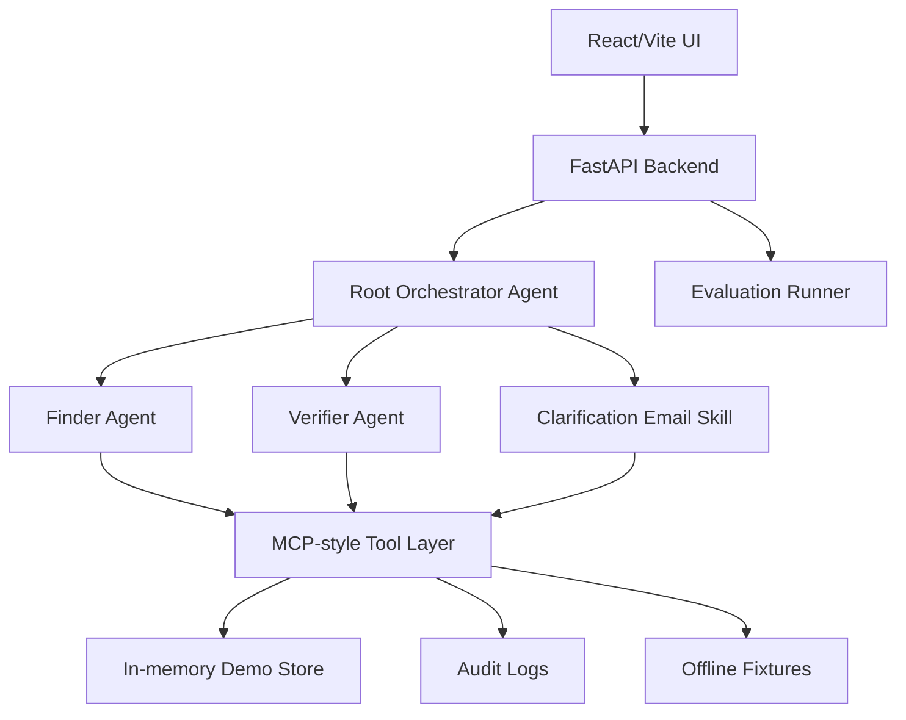

# ScholarProof

Find scholarships that are real and right for you.

ScholarProof is a Kaggle AI Agents: Intensive Vibe Coding Capstone project for the Agents for Good track. It helps international students find scholarship opportunities, verify official sources, and check whether scholarship rules fit a lightweight student profile.

ScholarProof provides evidence-backed scholarship fit guidance. It does not guarantee admission, funding, eligibility, or scholarship success. Final decisions belong to universities, governments, or scholarship providers.

## Current Status

ScholarProof currently includes the core verification engine, eval harness, FastAPI backend, MCP-style tool layer, ADK-style agent layer, React/Vite frontend UI, and fixture/offline demo mode.

## Core Rule

Unclear beats wrong.

ScholarProof never marks a scholarship as `eligible` unless official evidence proves the key eligibility rules.

## Student-Facing Statuses

| Internal status | UI label | Meaning |
|---|---|---|
| `eligible` | Strong Fit | Official source found and key rules match the profile. |
| `unclear` | Needs Clarification | Relevant, but one or more important rules are unclear. |
| `not_eligible` | Not for You | Official source contains a blocking rule. |
| `unverified` | Unverified Lead | Found online, but no acceptable official source proves it yet. |

## MVP Workflow

1. Create a lightweight student profile.
2. Search fixture scholarships.
3. Verify each candidate against official-source evidence.
4. Review matched, blocking, and unclear rules.
5. Inspect the evidence panel and audit timeline.
6. Draft a clarification email only for unclear cases.
7. Save simple verification results.

The MVP does not include portal autofill, application submission, automatic email sending, sensitive document uploads, generic SOP writing, or claims of global scholarship coverage.

## Architecture



## Course Concepts Demonstrated

| Concept | Demonstration |
|---|---|
| Agent / multi-agent system using ADK | Root Orchestrator, Finder Agent, Verifier Agent, and Clarification Email Skill wrapper. |
| MCP Server | MCP-style tool layer exposing structured scholarship verification tools. |
| Antigravity | Demo steps and video workflow in `docs/antigravity_demo_steps.md`. |
| Security features | Official-source gate, prompt-injection detection, no auto-send, no auto-submit, no sensitive uploads, and audit logs. |
| Deployability | `.env.example`, `/health`, deployment guide, reproducible fixture mode, and local build checks. |
| Agent Skills | Four skills in `.agent/skills/`. |

## Backend Setup

Create and activate a virtual environment:

```bash
python -m venv .venv
```

On Windows PowerShell:

```bash
.\.venv\Scripts\Activate.ps1
```

On macOS/Linux:

```bash
source .venv/bin/activate
```

Install backend dependencies:

```bash
pip install -r requirements.txt
```

Run the backend:

```bash
python -m scholarproof
```

Backend docs:

```text
http://127.0.0.1:8000/docs
```

## Frontend Setup

Run the frontend:

```bash
cd scholarproof/ui
npm install
npm run dev
```

Frontend URL:

```text
http://127.0.0.1:5173/
```

## Checks

Run the verification evals:

```bash
python -B evals/run_evals.py
```

Run backend, tool, and agent smoke tests:

```bash
python -B scripts/smoke_api.py
python -B scripts/smoke_tools.py
python -B scripts/smoke_agents.py
```

Run the frontend build:

```bash
cd scholarproof/ui
npm run build
```

Hard eval gate:

```text
false_eligible_count = 0
```

## API Routes

- `GET /health`
- `POST /api/profile`
- `GET /api/profile/{profile_id}`
- `POST /api/search-scholarships`
- `POST /api/verify-scholarship`
- `GET /api/evidence/{verification_id}`
- `POST /api/draft-email`
- `POST /api/save-result`
- `GET /api/saved-results/{profile_id}`
- `GET /api/audit/{verification_id}`

## MCP-Style Tool Layer

The tool layer lives in `scholarproof/mcp_server/` and exposes structured JSON tools:

- `search_scholarships`
- `fetch_page`
- `classify_source`
- `extract_rules`
- `match_profile`
- `generate_verdict`
- `save_result`
- `write_audit_log`
- `detect_prompt_injection`

List available tools:

```bash
python -m scholarproof.mcp_server list
```

Call one tool from the command line:

```bash
python -m scholarproof.mcp_server call classify_source fixture_id=eligible_01
```

## ADK-Style Agent Layer

The agent layer lives in `scholarproof/agents/` and demonstrates a bounded multi-agent workflow:

- `RootOrchestratorAgent` accepts a profile and query, calls Finder, routes candidates to Verifier, and groups verified results.
- `FinderAgent` calls `search_scholarships` and returns structured candidates only. It never decides eligibility.
- `VerifierAgent` calls the tool sequence: fetch, classify, injection check, extract, match, verdict, audit.
- `ClarificationEmailSkillWrapper` drafts emails only for `unclear` results and never sends them.

## Frontend UI

The frontend lives in `scholarproof/ui/` and includes:

- Profile Wizard.
- Find Scholarships.
- Eligibility Checker.
- Evidence Panel.
- Draft Clarification Email.
- Saved Results.

The frontend uses checklist items for documents. It does not upload passports, bank statements, transcripts, or other sensitive files. It does not include a Send button.

## External Tools Used

- OpenAI Codex: coding assistant.
- Google Antigravity: agentic development/demo workflow.
- FastAPI: backend.
- React/Vite: frontend.
- Python eval scripts.
- Fixture/offline demo mode.

## Rules Compliance / Safety

- No committed secrets.
- No private datasets.
- No redistributed course PDFs.
- No auto-send email.
- No auto-submit application.
- No sensitive document uploads.
- Fixture/offline mode for reproducibility.
- Conservative verdict policy.
- `false_eligible_count` target is 0.

## Security Design

Security details are documented in `docs/security.md`.

Key controls:

- Official-source-only eligibility gate.
- Aggregators are leads only, never proof.
- Prompt injection detection.
- Fetched pages treated as untrusted data.
- Draft-only clarification emails.
- Audit logs for verification steps.

## Limitations

- ScholarProof does not guarantee admission, eligibility, funding, or scholarship success.
- ScholarProof does not find every scholarship in the world.
- Ambiguous cases are marked Needs Clarification.
- Final decisions belong to universities, governments, or scholarship providers.
- Current MVP uses fixture/offline data for reproducible demo.

## Documentation

- `docs/kaggle_rubric_mapping.md`
- `docs/security.md`
- `docs/evaluation.md`
- `docs/deployment.md`
- `docs/frontend_screenshots.md`
- `docs/video_script.md`
- `docs/antigravity_demo_steps.md`
- `specs/scholarproof_system_spec.md`

## License

This project code is released under the MIT License.
