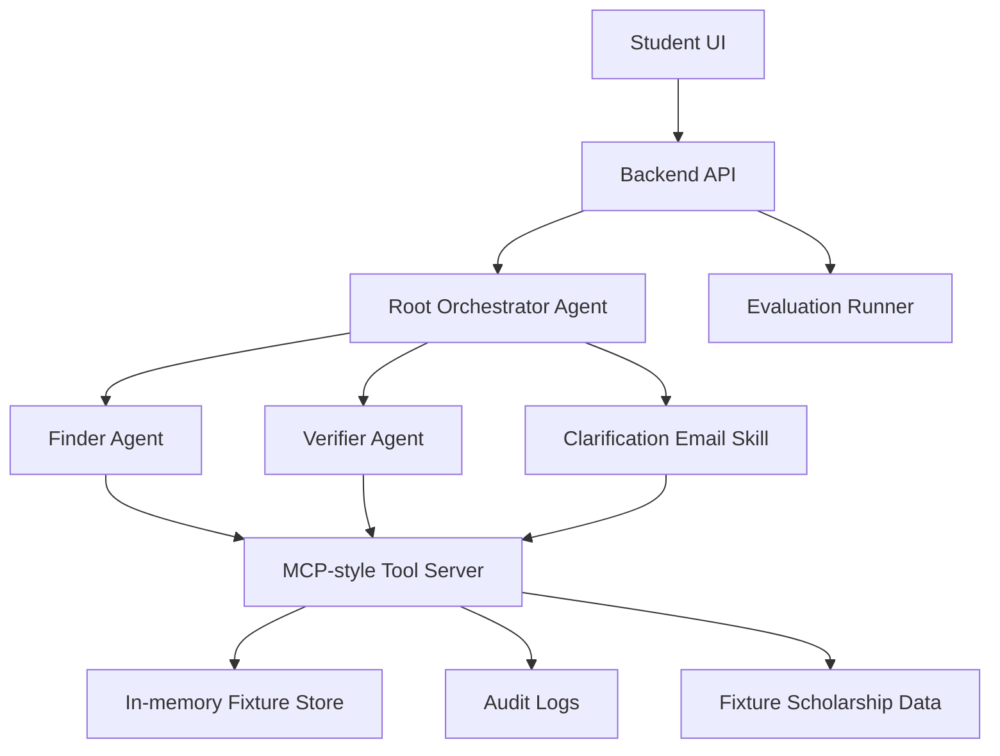

# Architecture

## Overview

Product name: FundMyDegree.



## Components

### Student UI

Screens:

- My Profile.
- My Matches.
- Does this scholarship fit you?
- Why this match?
- Ask to confirm.
- Saved.

### Backend API

Routes:

- `GET /health`
- `POST /api/profile`
- `GET /api/profile/:id`
- `POST /api/search-scholarships`
- `POST /api/verify-scholarship`
- `GET /api/evidence/:verification_id`
- `POST /api/draft-email`
- `POST /api/save-result`
- `GET /api/saved-results/:profile_id`
- `GET /api/audit/:verification_id`

### Root Orchestrator Agent

Coordinates the workflow. It never produces final eligibility without Verifier Agent output.

### Finder Agent

Finds candidate scholarships and returns structured candidate data. It does not decide eligibility.

### Verifier Agent

Handles:

- Source verification.
- Eligibility rule extraction.
- Profile matching.
- Conservative verdicting.
- Evidence generation.

### Clarification Email Skill

Drafts a safe email only when status is `unclear`. It never sends email.

### MCP-Style Tool Server

Exposes structured tools:

- `search_scholarships`
- `fetch_page`
- `classify_source`
- `extract_rules`
- `match_profile`
- `generate_verdict`
- `save_result`
- `write_audit_log`
- `detect_prompt_injection`

### In-Memory Fixture Store

Stores:

- Profiles.
- Candidates.
- Verification results.
- Clarification email drafts.
- Saved results.
- Audit events.

This is intentionally not a production database. It keeps the Kaggle demo reproducible and avoids adding account or data-retention scope.

### Evaluation Runner

Runs fixture cases and enforces:

```text
false_eligible_count = 0
```
